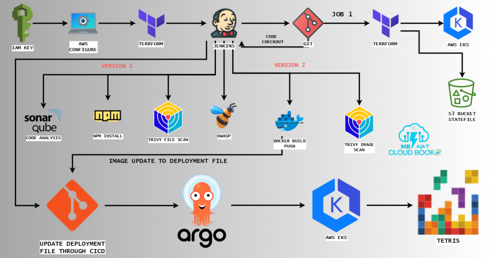
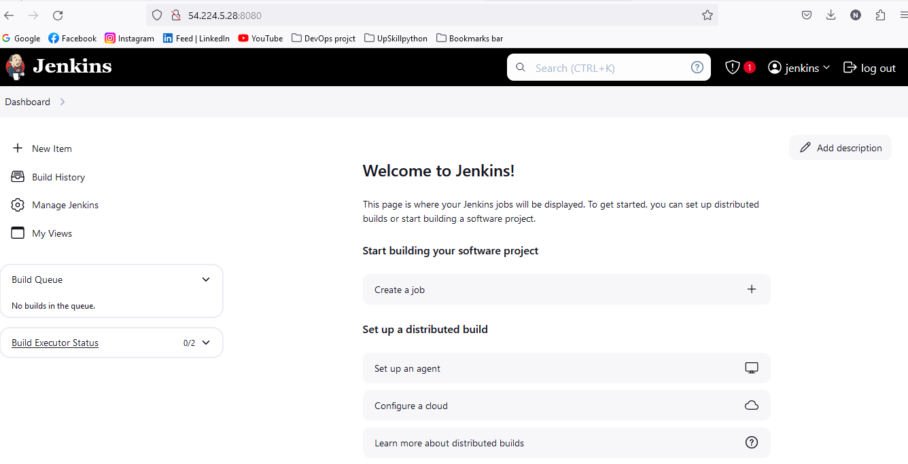
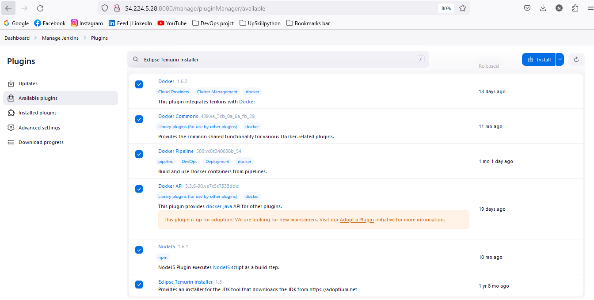
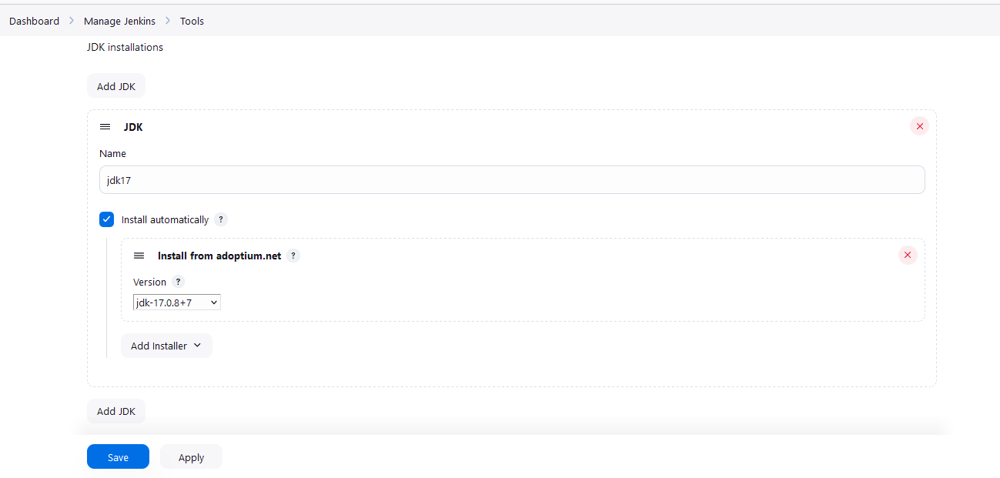
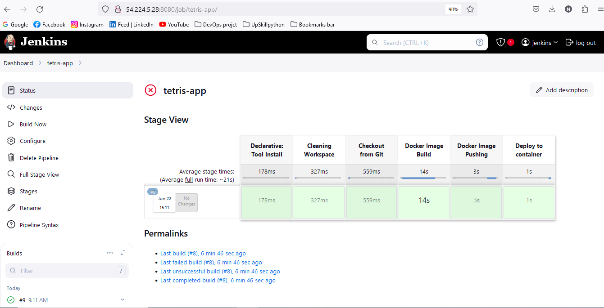
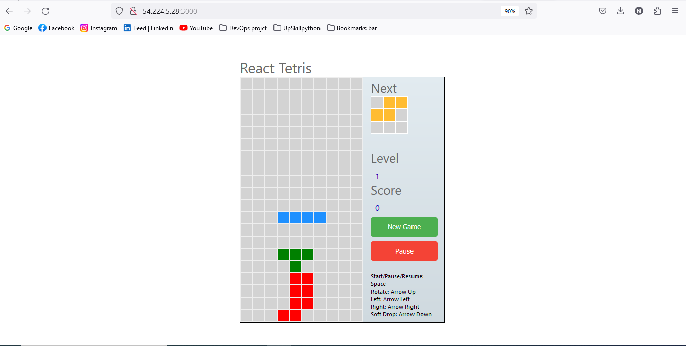
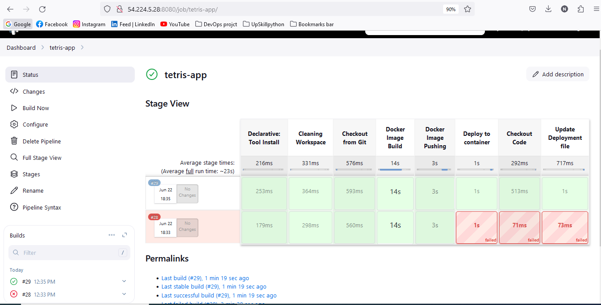
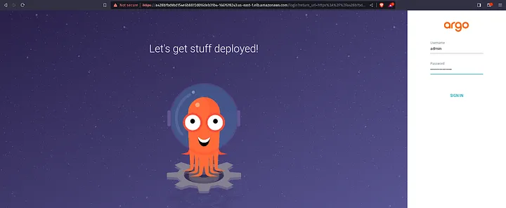

# React Tetris App :Step-by-Step Guide to Deploying Tetris app on AWS EKS with Argo CD and GitOps
In this guide, we will demonstrate the deployment of a Tetris game using AWS Elastic Kubernetes Service (EKS), Argo CD, and the principles of GitOps.
GitOps, a set of practices for managing and automating IT infrastructure and software delivery processes, leverages Git as the single source of truth for declarative infrastructure and applications. This approach is particularly efficient for Kubernetes applications because it emphasizes version control and automated deployments.


---

## Tools Used:

- AWS Account
- Jenkins
- Github
- SonarQube
- Trivy
- Docker & Dockerhub
- teraform (for ec2 & Eks Setup)
- Aws Cli

### Step 1: Clone repository
```shell 
    git clone https://github.com/nusratdevo/Tetris-argo-app.git
    cd Tetris-argo-app/Jenkins-terraform/
```


### Step 2: EC2 Setup using terraform
- Run the following commands. 
``` shell 
terraform init
terraform validate 
terraform plan
terraform apply --auto-approve
terraform destroy --auto-approve
```
- after all work done infrastructure should be destroy: `terraform destroy`
- SSH into the instance from your local machine.

### Step 3: check every tools install successfully

```shell
jenkins --version
docker --version
terraform --version
which terraform
path: /usr/bin/terraform
aws version
docker ps
trivy --version
kubectl version --client --short
```

### Step 4: Open jenkins in browser, login and install tools

```shell
Open jenkins on port <EC2 Public_IP>:8080
administrative password : sudo cat /var/lib/jenkins/secrets/initialAdminPassword
```

---
### Step 5: Sonar server configuration

- Sonarqube works on Port 9000, so <Public_IP>:9000. username: admin, password: admin
.png)
---
- Create SonarQube token : Click on Administration ,Give a name for token → and click on Generate Token
- In the Sonarqube Dashboard, Create Webhook ``` url <http://public_ip:8080/sonarqube-webhook/>```
.png)
---
- In jenkins dashbord add sonar server: name(soner-server), ``` url <http://public_ip:9000>```

.png)
---
### step 6: Set up Jenkins Plugins:

- Goto Jenkins Dashboard → Manage Jenkins → Plugins → Available Plugins

* Docker
* Docker Commons
* Docker Pipeline
* Docker API
* NodeJs Plugin
* SonarQube Scanner
* Owasp Dependency Check
* Terraform
* AWS Credentials
* Pipeline: AWS Steps
* Prometheus metrics plugin
* Eclipse Temurin Installer (Install without restart)
* Prometheus Plugin (to monitor pipeline)
* Kubernetes
* Kubernetes CLI
* Kubernetes Client API
* Kubernetes Pipeline DevOps steps



### step 5: Set up Jenkins Tools Configuration:

- Goto Jenkins Dashboard → Manage Jenkins → Tools

* JDK Installations (Install from adomptium.net), Name (jdk17)


---
* SonarQube Scanner Installations(Install from Maven Central),Name (sonar-scanner)
.png)
---
* NodeJs   Installations (Install from nodejs.org) Name(nodejs)
* Dependency-Check Installations (Install from github.com) Name(DP-Check)
.png)
---
* Docker Installation (Download from docker.com) Name(docker)

.png)
---
* Terraform Installations (install directory /usr/bin) Name(terraform)


### step 6: Set up credentials:

- Goto Dashboard → Manage Jenkins → Credentials → system → Global credentials (unrestricted)→ Add Credentials
- kind(username with password)->username(dockerhub username)->password(dockerhub pass)->Id(dockerHub)

.png)
---
- setup credentials: dockerhub, sonar-token
.png)
---

.png)
- AWS Credentials: kind(AWS Credentials), ID(aws-key)
- Github Credentials: Create personal access token (classic), kind(username with password), ID(github)

### step 7: Create EKS Cluster with terraform In parameterize pipline
- create new item with pipline name
- Navigate to Pipeline section. Check This build is parameterize
- name (action), parameter (apply, destroy)->save
- Click on build with parameter Apply.
Image: 

## step 8: build jenkins pipline to build and push the Docker image.
 - Navigate to pipeline section.
 ``` shell 
 i. Script from SCM
 ii. then Git
 iii. Github Credentials
 iv. repository Branch :main
 v. Script path: Jenkins-CICD/Jenkinsfile
 vi. Discard old build(check), builds keep 2
```


---
- Deploy application on docker container add this stage to pipeline
```shell
 stage('Deploy to container'){
            steps{
                sh 'docker run -d --name tetris -p 3000:3000 nusratdevo/tetrisvi:latest'}
        }
```

---

### step 9:  Configure EKS in jenkins:
# Image updater stage
```shell
 environment {
    GIT_REPO_NAME = "Tetris-argo-app"
    GIT_USER_NAME = "nusratdevo"
  }
    stage('Checkout Code') {
      steps {
        git branch: 'main', url: 'https://github.com/nusratdevo/Tetris-argo-app.git'
      }
    }

       stage('Update Deployment file') {
            environment {
                GIT_REPO_NAME = "Tetris-argo-app"
                GIT_USER_NAME = "nusratdevo"
            }
            steps {
                dir('manifest-file') {
                    withCredentials([string(credentialsId: 'github', variable: 'GITHUB_TOKEN')]) {
                        sh '''
                            git config user.email "nusratdevo@gmail.com"
                            git config user.name "nusratdevo"
                            BUILD_NUMBER=${BUILD_NUMBER}
                            echo $BUILD_NUMBER
                            imageTag=$(grep -oP '(?<=tetrisv1:)[^ ]+' deployment.yml)
                            echo $imageTag
                            sed -i "s/tetrisv1:${imageTag}/tetrisv1:${BUILD_NUMBER}/" deployment.yml
                            git add deployment.yml
                            git commit -m "Update deployment Image to version \${BUILD_NUMBER}"
                            git push https://${GITHUB_TOKEN}@github.com/${GIT_USER_NAME}/${GIT_REPO_NAME} HEAD:main
                        '''
                    }
                }
            }
        }

```


---
### Step 10: add Email to jenkins 
- Go to gmail account-> manage your google account->security->app passwords (generate a password that will add to jenkins credentials)

- Goto Mange jenkins -> credentials -> system -> Global credentials: kind(username woth password) Username(gmail_id) and password that is recently generated, ID (mail).
- Go to Manage Jenkins->Configure System->"E-mail Notification" section.

- provide details: SMTP server host, port, and credentials (username and password).

- You can also configure advanced settings such as SSL/TLS encryption and response timeout.
- Click on "Test configuration". If the configuration is correct, you should receive a test email.
- click extended Email-Notification: provide details: SMTP server(smtp.gmail.com),SMTP port(465), and credentials (username and password), use SSL, Default Content Type (HTML) default triger (always,  failure).
``` shell
   post {
        always {
            emailext attachLog: true,
                subject: "'${currentBuild.result}'",
                body: "Project: ${env.JOB_NAME}<br/>" +
                    "Build Number: ${env.BUILD_NUMBER}<br/>" +
                    "URL: ${env.BUILD_URL}<br/>",
                to: 'hr.nusrat@gmail.com',
                attachmentsPattern: 'trivy.txt'
                }
           }
```

### step 9:  Configure EKS and ArgoCD:
- ArgoCD install using a manifest provided by the Argo Project:
``` bash
kubectl create namespace argocd
kubectl apply -n argocd -f https://raw.githubusercontent.com/argoproj/argo-cd/v2.4.7/manifests/install.yaml
```
- we will use a Load Balancer to make argocd-server publicaly exposed.
``` shell 
kubectl patch svc argocd-server -n argocd -p '{"spec": {"type": "LoadBalancer"}}'

# Wait for 2 minutes and then
export ARGOCD_SERVER=`kubectl get svc argocd-server -n argocd -o json | jq --raw-output '.status.loadBalancer.ingress[0].hostname'`

# The initial password is autogenerated with the pod name of the ArgoCD API server:
export ARGO_PWD=`kubectl -n argocd get secret argocd-initial-admin-secret -o
jsonpath="{.data.password}" | base64 -d`
```
- Print out the server and password:
```shell 
echo ARGOCD_SERVER
echo ARGOCD_PWD
```
-Paste the DNS name of loadbalancer on browser
- image: 


- By create app by clicking on edit as yaml.
``` shell
project: default
source:
  repoURL: 'https://github.com/nusratdevo/Tetris-argo-app.git'
  path: K8s/
  targetRevision: HEAD
destination:
  server: 'https://kubernetes.default.svc'
  namespace: default
syncPolicy:
  automated:
    prune: true
    selfHeal: true
  ```  
- Check if all are up and running and Copy the DNS name and paste it browser.
.png)
---
.png)
---
.png)
```shell
kubectl get all
kubectl get svc
```
